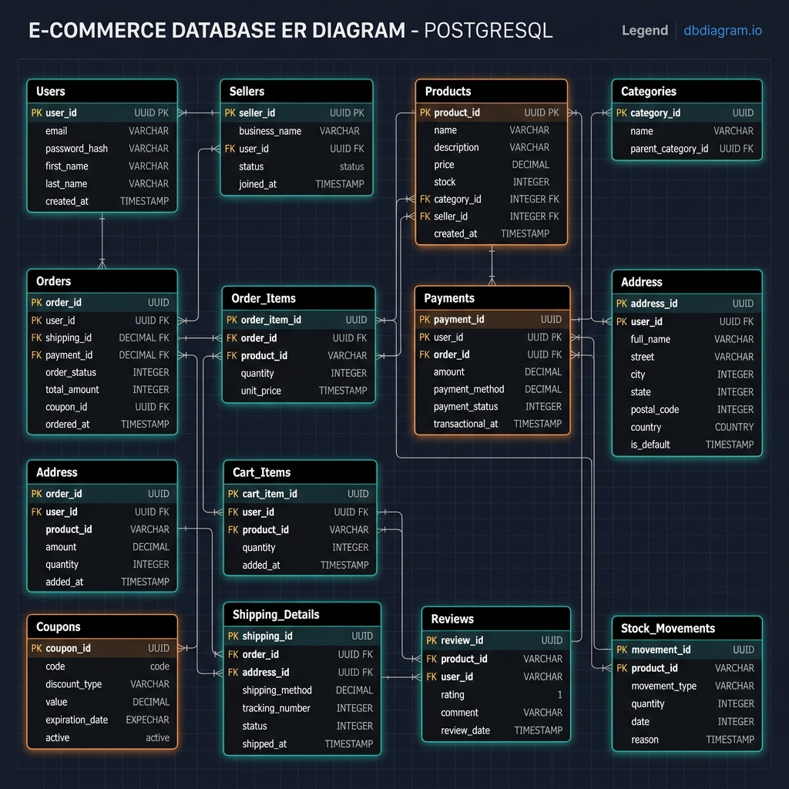

# Entity-Relationship (ER) Diagram

A visual representation of the e-commerce database schema, highlighting core transactional tables, normalized address tables, multi-vendor support, customer cart/wishlists, review system, and inventory logging.

---

## Key Schema Components

1. **User & Vendor Core**:
   - `Users` persist customer identity.
   - `Sellers` support multi-vendor operations. Products are associated directly with a vendor.

2. **Hierarchical Categories**:
   - `Categories` support parent-child relationships via a self-referencing foreign key `parent_id` (e.g. `Electronics` -> `Mobile Phones`).

3. **Normalization (3NF)**:
   - Location columns are normalized across `Country`, `State`, `City`, and `Address` tables to avoid duplicate text insertions and keep referential integrity.

4. **Transactional Entities**:
   - `Orders` log checkouts and apply `Coupons`.
   - `Order_Items` hold order line items and capture historical product prices.
   - `Payments` track UPI, Card, and COD payment states.
   - `Shipping_Details` maintain estimated delivery times and tracking logs.

5. **Customer Session Persistance**:
   - `Carts` / `Cart_Items` persist current items during shopping sessions.
   - `Wishlists` / `Wishlist_Items` manage bookmarks.
   - `Reviews` store customer product ratings and reviews.
   - `Stock_Movements` record stock logs for auditing.
